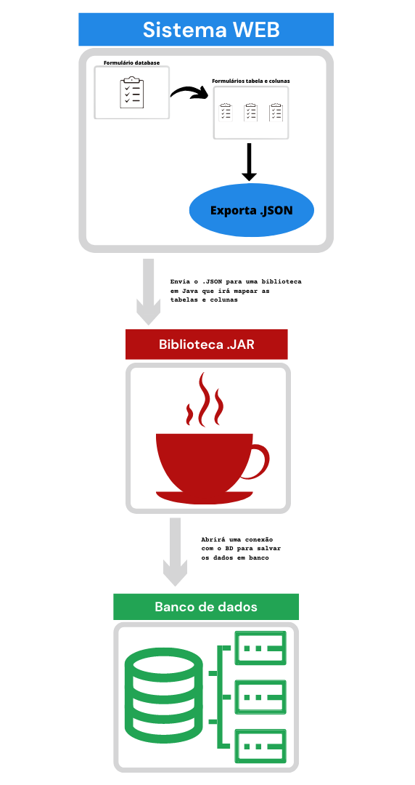

# 🚀 Biblioteca JAVA
Projeto utilizando padrão **generics** na escolha do banco de dados. Sendo possível implementar a utilização de outro SGBD

Projeto realizado na disciplina de Programação Orientada a Objeto 2. 
Orientador: [**Rodrigo Curvêllo**](http://buscatextual.cnpq.br/buscatextual/visualizacv.do)

___
## 📌 Ferramentas e linguagens

[Composer](https://getcomposer.org/)         
[Symfony](https://symfony.com/)          
[Doctrine](https://www.doctrine-project.org) 
[Java JDK 17](https://www.oracle.com/java/technologies/javase/jdk17-archive-downloads.html)   
[PHP 7.4](https://www.php.net/releases/7_4_0.php)
 
 ___
## 
 🎯 Proposta do projeto 

 

#### O trabalho será desenvolvido em duas etapas:
 

 

**1ª etapa** será construir um sistema WEB onde terá 2 telas de formulário: 
primeira tela será um formulário solicitando as informações do banco - _nome do database, url, porta, user, senha e sgbd (tendo como padrão o MySQL)_.  A segunda tela será sobre as tabelas e as colunas (pode haver _n_ tabelas e cada tabela poderá ter _n_ colunas). Informações sobre a tabela será somente o nome, e da coluna será o _nome da coluna, o tipo do dado e poderá ser null_
 
 
 
**2ª etapa** será desenvolver uma biblioteca em JAVA. Que irá mapear os campos do json e irá abrir uma conexão com o banco (já existente) para salvar os dados conforme as informações do banco. Deverá usar o padrão _genercis_ onde futuramente poderá ser implementado outros sistemas de gerenciamento de banco de dados (como postegreesql, mongodb, sqlserver...).
 
 
  
 
 

 

____

## ⚙️ Info

**Instalar no windows** 
scoop: 
$ `Set-ExecutionPolicy RemoteSigned -scope CurrentUser`
$ `Invoke-Expression (New-Object System.Net.WebClient).DownloadString('https://get.scoop.sh')`

symfony 
$ `scoop install symfony-cli`

run project: 
$ `symfony server:start`   **Dentro da pasta web** 

instalar as dependencias do composer:  
$ `composer install`

## Padrão do JSON

~~~json
{
    "nome": "string",
    "url": "string",
    "porta": 0,
    "usuario": "sring",
    "senha": "string",
    "sgbd": "string",
    "tabela": [
        {
            "nome": "string",
            "coluna": [
                {
                    "nome": "string",
                    "tipo": "string",
                    "isNotNull": true
                }
            ]
        }
    ]
}
~~~
