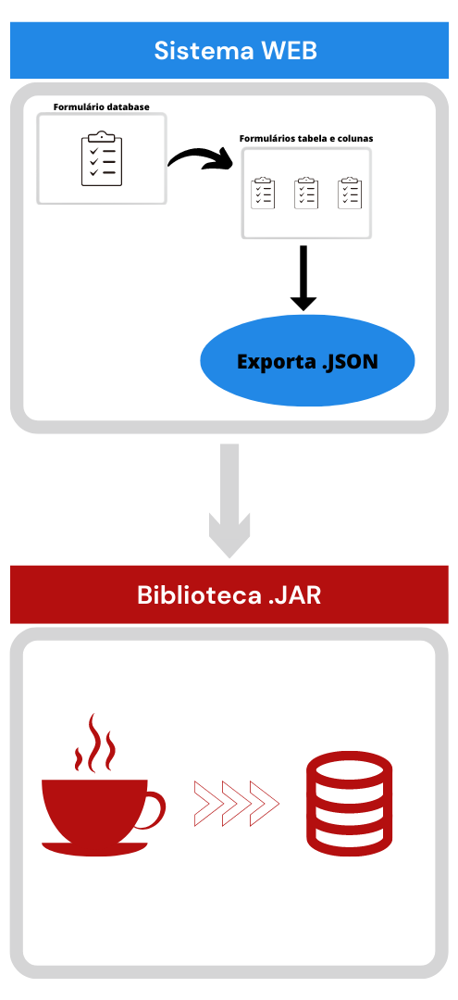

# 🚀 Biblioteca JAVA
Projeto utilizando padrão **generics** na escolha do banco de dados. Sendo possível implementar a utilização de outro SGBD

Projeto realizado na disciplina de Programação Orientada a Objeto 2. 
Orientador: [**Rodrigo Curvêllo**](http://buscatextual.cnpq.br/buscatextual/visualizacv.do)

___
## 📌 Ferramentas e linguagens

[Composer](https://getcomposer.org/)         
[Symfony](https://symfony.com/)          
[Doctrine](https://www.doctrine-project.org) 
[Java JDK 17](https://www.oracle.com/java/technologies/javase/jdk17-archive-downloads.html)   
[PHP 7.4](https://www.php.net/releases/7_4_0.php)
 
 ___
##    🎯 Proposta do projeto
 

O trabalho será desenvolvido em duas etapas:

1ª etapa será construir um sistema WEB onde terá 2 telas:
primeira tela será um formulário solicitando as informações do banco - _nome, url, porta, user, senha e sgbd_. A segunda tela será sobre as tabelas e as colunas (pode haver _n_ tabelas e cada tabela poderá ter _n_ colunas).

2ª etapa será desenvolver uma biblioteca em JAVA. Que irá mapear os campos do json e irá abrir uma conexão com o banco para salvar os dados conforme as informações do banco. Deverá usar o padrão _genercis_ onde futuramente poderá ser implementado outros sistemas de gerenciamento de banco de dados.

 

____

## ⚙️ Info

run project: 
$ `symfony server:start`   **Dentro da pasta web** 

instalar as dependencias do composer:  
$ `composer install`

